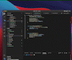

# :cupid: cute-game diary :cupid:
### Description
I'm making a little game using C++ and SDL in my spare time (weekends and evenings after work), this is a sort of diary/log of things I add to it.

### :dizzy: Day 1 - 3 (21st - 23rd Sept) :dizzy:
* Basic game loop stuff implemented (opening a window, processing input, update loop, rendering)
* Created 'scenes' and 'boxes' to fill scenes (the boxes are to be used behind-the-scenes as walk boxes for the player etc)
* Functionality to ensure a 'box' knows the box to it's north, east, south, west
* Can look up boxes either by id OR by a 'midpoint' key (explanation why I've done it like this below)
* Functionality to colour the scene boxes (this is not for the game and is only useful for my debugging/testing purposes, also it's fun)
* Can click in a box and find what the id of that box is

### :dizzy: Looking up boxes by midpoint - why :dizzy:

I know I need some way to find a box's id. 
Two example usages I can think of for why I need this: 
* If the user clicks in a spot in the game window, I want to know what 'box' those screen coords are within so I can check info about the box (eg. is that box walkable? etc.)
* When initializing boxes for a scene (which happens when a scene is initialized), for each 'box' I want it to know the boxes that are to the north, east, south and west of it (for pathfinding etc), I don't know these other box id's when I am initializing the current box but I can find their location relative to the current box, so I can use that to get the id's perhaps?

So my solution for this was that if I can find the approx midpoint for each box (I have the origin x and y of my current box so I can use that and the BOX_WIDTH/BOX_HEIGHT to find the origin x/y of the other boxes surrounding it, and then use that plus half of the BOX_WIDTH/BOX_HEIGHT to find an approx midpoint) then I can use that value to create a key for each box and store it's id as the value at that key. SO then, for example, if I click an area on the screen I can find the origin x/y of that box (by rounding down to the nearest multiple of box_width/box_height for the x/y coords of my click), then I can find the midpoint, convert it to the format I used for my key and then use that key to look up which box the click was in!

# :clapper: Day 1 - 3 progress clip! :clapper:

**Next Steps**
Over the next few days I want to:
* Create some sort of player character represented visually by a sprite
* If the user clicks on an area in the window:
* Find the square that the user clicked within
* Find out if that square is walkable
* If it is walkable, find the shortest path to that square
* Make the player 'walk' that path to the destination square